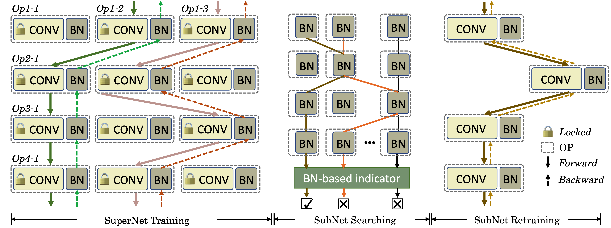

BN-NAS: Neural Architecture Search with Batch Normalization
=========================================
Code for [BN-NAS: Neural Architecture Search with Batch Normalization](https://arxiv.org/abs/2108.07375) accepted by ICCV2021

<!--  -->


This project is the re-implementation based on [ABS](https://github.com/megvii-model/AngleNAS) and [SPOS](https://github.com/megvii-model/SinglePathOneShot).

## Requirements
- Pytorch 1.3
- Python 3.5+
- [Apex](https://github.com/NVIDIA/apex)

The requirements.txt file lists other Python libraries that this project depends on, and they will be installed using:
pip3 install -r requirements.txt

## Results
|method|    Architecture         |  FLOPs    |   Params |   Top-1   | Supernet| ea_log| retrain model|
|:------:|:---------------------------:|:----------:|:----------:|:----------:|:----------:|:----------:|:----------:|
|BNNAS|[3, -1, 0, 4, 0, -1, -1, 0, 4, -1, 4, 4, 1, 4, 2, 0, 0, 4, 0, 2, 2]  |   473.5M    |	  5.2M    |     75.5    | [supernet](https://drive.google.com/file/d/1FgDm_FX7x1EK2yR0l6flAevp9YyZCaKB/view?usp=sharing)| [ea_log](https://drive.google.com/file/d/1PCsfX9le8H8RmLaBHApL2tSr6Cxmi_EX/view?usp=sharing)| [retrain model](https://drive.google.com/file/d/1PiSZeXnGMTDm1oWraAkBGgsc0dlujexu/view?usp=sharing) |
|SPOS|[0, -1, 0, 0, 4, -1, -1, 2, 0, -1, 4, 4, 3, 0, 2, 1, 0, 4, 2, 5, 2]|468.8M|5.8M| 75.4| [supernet](https://drive.google.com/file/d/1VALEq2Y4vjoZN8hJkSk0HeUBeD8nM31L/view?usp=sharing)| [ea_log](https://drive.google.com/file/d/1y2ei6V1VH2r7wlrV3jnAGcCoQiKaVPx6/view?usp=sharing)| [retrain model](https://drive.google.com/file/d/1TDRt3e-iDTbyn6KkJsBozPbsndH5f9f9/view?usp=sharing) |


## Usage
### Step 1: Setup Dataset
Run `utils/get_flops_lookup_table.sh` to generate flops lookup table which is required in Uniform Sampling.

### Step 2: Training supernet
```
cd BNNAS/supernet
python3 -m torch.distributed.launch --nproc_per_node=8 main.py \
                                    --train_dir YOUR_TRAINDATASET_PATH
```

### Step 3: Search subnets
```
cd BNNAS/search
cp ../supernet/checkpoint.pth.tar checkpoint.pth.tar
python3 ea.py
```

### Step 3.5 (optional): Show searching result
download the [ea_results.pth.tar](https://drive.google.com/file/d/1PCsfX9le8H8RmLaBHApL2tSr6Cxmi_EX/view?usp=sharing) and put it in `BNNAS/search/log`
```
cd BNNAS/search
python3 eval.py
```

### Step 4: Subnet retraining
```
cd BNNAS/retrain
python3 -m torch.distributed.launch --nproc_per_node=8 train_from_scratch.py \
                            --train_dir $YOUR_TRAINDATASET_PATH --test_dir $YOUR_TESTDATASET_PATH
```

## Thanks
This implementation of BNNAS is based on [ABS](https://github.com/megvii-model/AngleNAS) and [SPOS](https://github.com/megvii-model/SinglePathOneShot). Please ref to their reposity for more details.

## Citation
If you find that this project helps your research, please consider citing our paper:
```
@inproceedings{chen2021bn,
  title={Bn-nas: Neural architecture search with batch normalization},
  author={Chen, Boyu and Li, Peixia and Li, Baopu and Lin, Chen and Li, Chuming and Sun, Ming and Yan, Junjie and Ouyang, Wanli},
  booktitle={Proceedings of the IEEE/CVF International Conference on Computer Vision},
  pages={307--316},
  year={2021}
}
```
